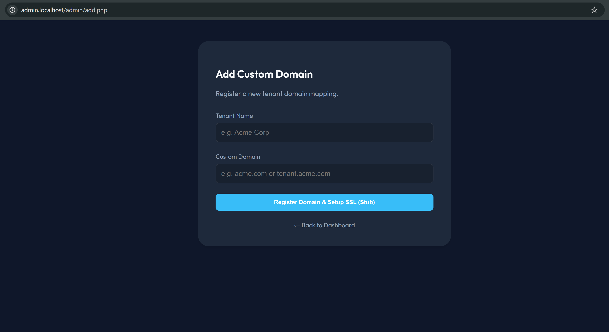
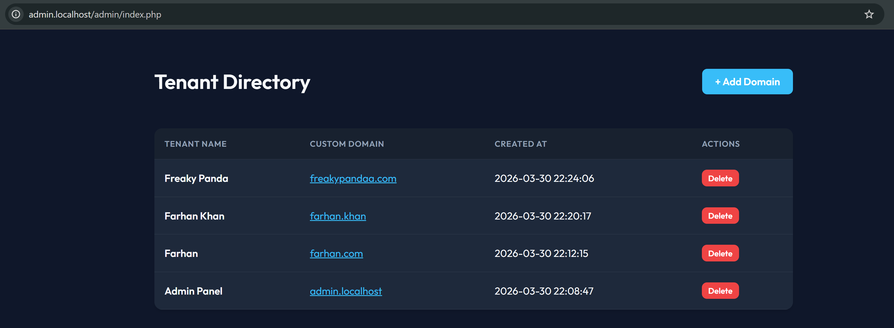
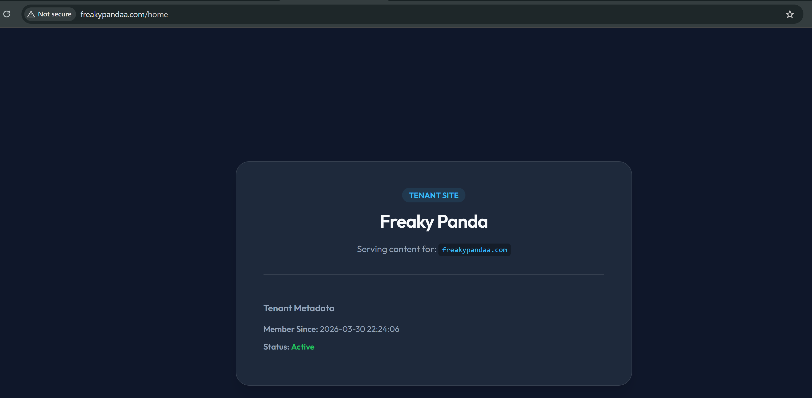
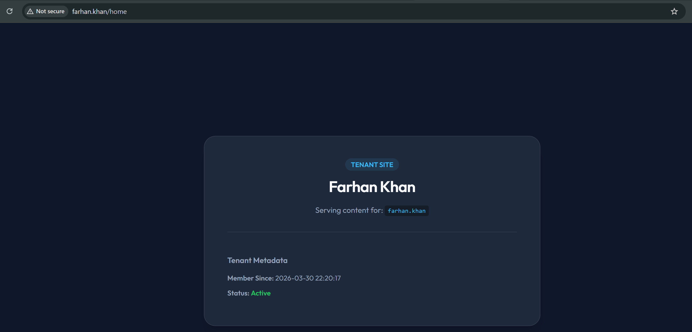

# 🌐 PHP Multi-Tenant SaaS Boilerplate

A professional, framework-less PHP starter for building SaaS applications with **custom customer domains**. This project demonstrates how a single Nginx host can route thousands of unique domains to a central engine.







---

## 🏗️ Project Architecture

This project is logically divided into two main areas to ensure scalability and separation of concerns:

### �️ `/admin` (The SaaS Engine)
The **Admin Panel** is the global control center for the SaaS owner.
- **Purpose**: Manage the platform, register new tenants, and monitor domain health.
- **Scope**: This folder contains all code related to the administrative side of the business (billing, tenant management, system logs).

### 🚀 `/app` (The Tenant Container)
The **App Folder** is where the actual customer-facing application lives.
- **Purpose**: A generic container that serves data specific to the resolved tenant.
- **Future-Proofing**: Currently, this is a "mock" landing page, but it is architected so you can replace it with **any application** (e.g., a CRM, E-commerce store, or POS system). 
- **How it works**: The front controller (`public/index.php`) resolves the tenant identity first, then "injects" that identity into this folder to render the correct customer experience.


---

## 🛠️ Quick Start

### 1. Launch environment
```bash
docker-compose up -d
```

### 2. Configure Local DNS
Add these to your `hosts` file (`C:\Windows\System32\drivers\etc\hosts`) to simulate real domains:
```text
127.0.0.1  admin.mock_saas
127.0.0.1  farhan.khan
127.0.0.1  freakypandaa
```

### 3. Explore
- **Dashboard**: [http://admin.mock_saas](http://admin.mock_saas)
- **New Tenant**: Add `farhan.khan` in the panel, then visit [http://farhan.khan/home](http://farhan.khan/home).

---

## 🧪 Testing with cURL (No DNS needed)
```bash
# Check Admin Panel
curl -H "Host: admin.mock_saas" http://localhost

# Check Registered Tenant
curl -H "Host: farhan.khan" http://localhost
```

---

## ☁️ Cloudflare for SaaS (Production SSL)
For production, use **Cloudflare for SaaS** to handle SSL effortlessly:
1. **CNAME**: Customers point `domain.com` to `proxy.your-saas.com`.
2. **API**: Your app calls the Cloudflare API (`src/CloudflareSaasService.php`) to automatically issue an SSL certificate for the new custom hostname.

---

## 🛠️ Commands Reference

| Action | Command |
| :--- | :--- |
| **Reset Database** | `php scripts/init_db.php` |
| **Start Containers** | `docker-compose up -d` |
| **Stop Containers** | `docker-compose down` |
| **View Logs** | `docker-compose logs -f` |


---

